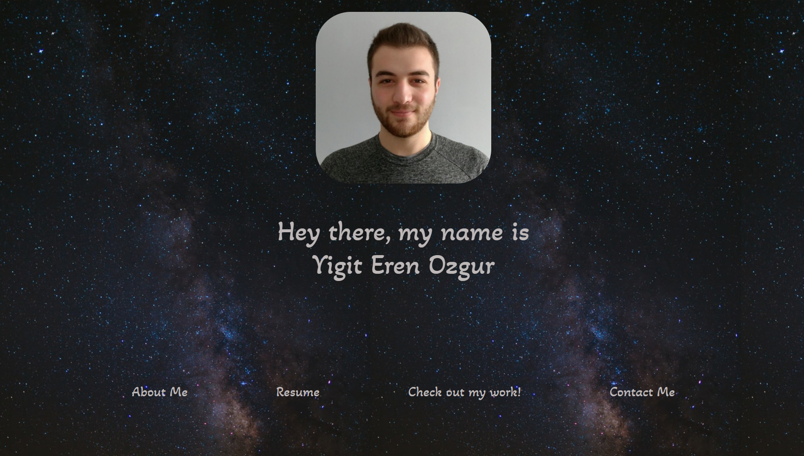

# **Yigit Eren Ozgur Portfolio**

## Table of Contents

* [Description](#description)
* [Requirements](#requirements)
* [Installation](#installation)
* [Credit](#credit)

## Description
---
Full-stack web developer leveraging customer service background to build a more intuitive user experience on the web. Recently earned a certificate in full stack development from the University of North Carolina Charlotte, with newly developed skills in JavaScript, CSS, React.js, and responsive web design. Known as an innovative problem solver passionate about developing apps, with a focus on mobile-first design and development. With each project, my aim is to best engage my audience for an impactful user experience

Deployed Portfolio: https://erenozgur98.github.io/yigiterenozgur-portfolio/



## Requirements
---
```
GIVEN I need to sample a potential employee's previous work
WHEN I load their portfolio
THEN I am presented with the developer's name, a recent photo, and links to sections about them, their work, and how to contact them
WHEN I click one of the links in the navigation
THEN the UI scrolls to the corresponding section
WHEN I click on the link to the section about their work
THEN the UI scrolls to a section with titled images of the developer's applications
WHEN I am presented with the developer's first application
THEN that application's image should be larger in size than the others
WHEN I click on the images of the applications
THEN I am taken to that deployed application
WHEN I resize the page or view the site on various screens and devices
THEN I am presented with a responsive layout that adapts to my viewport
```

## Installation
---
No need for any installation for this project.

See deployed site here: https://erenozgur98.github.io/yigiterenozgur-portfolio/

See repository here: https://github.com/erenozgur98

## Credit

---

Background image from: Ivana Cajina from Unsplash.com


