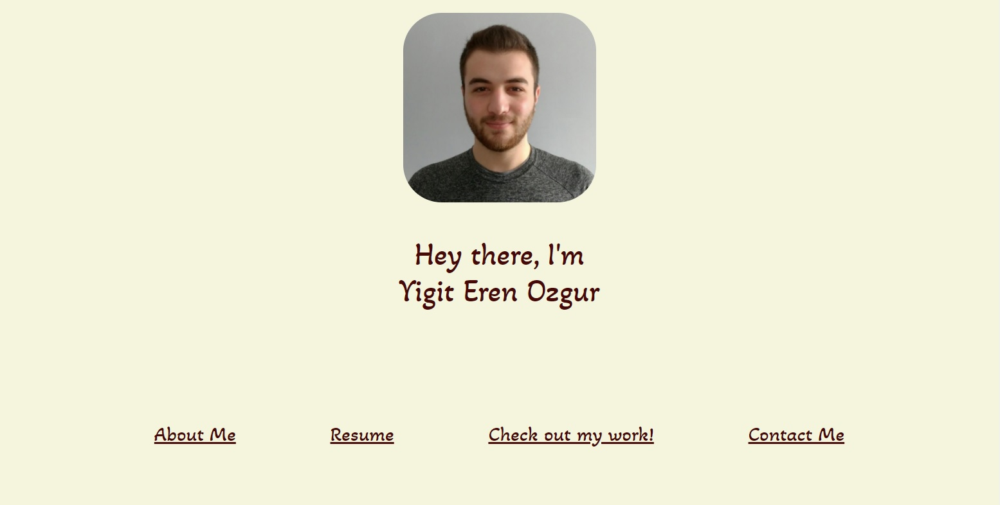

# **Yigit Eren Ozgur Portfolio**

## Table of Contents

* [Description](#description)
* [Requirements](#requirements)
* [Installation](#installation)
* [Credit](#credit)

## Description
---
This is my Portfolio. The task was to create a portfolio for a potential employer can see my work samples to decide whether I would be a good candidate or not for the position I am applying for.

Deployed Portfolio: https://erenozgur98.github.io/yigiterenozgur-portfolio/



## Requirements
---
```
GIVEN I need to sample a potential employee's previous work
WHEN I load their portfolio
THEN I am presented with the developer's name, a recent photo, and links to sections about them, their work, and how to contact them
WHEN I click one of the links in the navigation
THEN the UI scrolls to the corresponding section
WHEN I click on the link to the section about their work
THEN the UI scrolls to a section with titled images of the developer's applications
WHEN I am presented with the developer's first application
THEN that application's image should be larger in size than the others
WHEN I click on the images of the applications
THEN I am taken to that deployed application
WHEN I resize the page or view the site on various screens and devices
THEN I am presented with a responsive layout that adapts to my viewport
```

## Installation
---
No need for any installation for this project.

See deployed site here: https://erenozgur98.github.io/yigiterenozgur-portfolio/

See repository here: https://github.com/erenozgur98

## Credit

---

Background image from: Ivana Cajina from Unsplash.com


